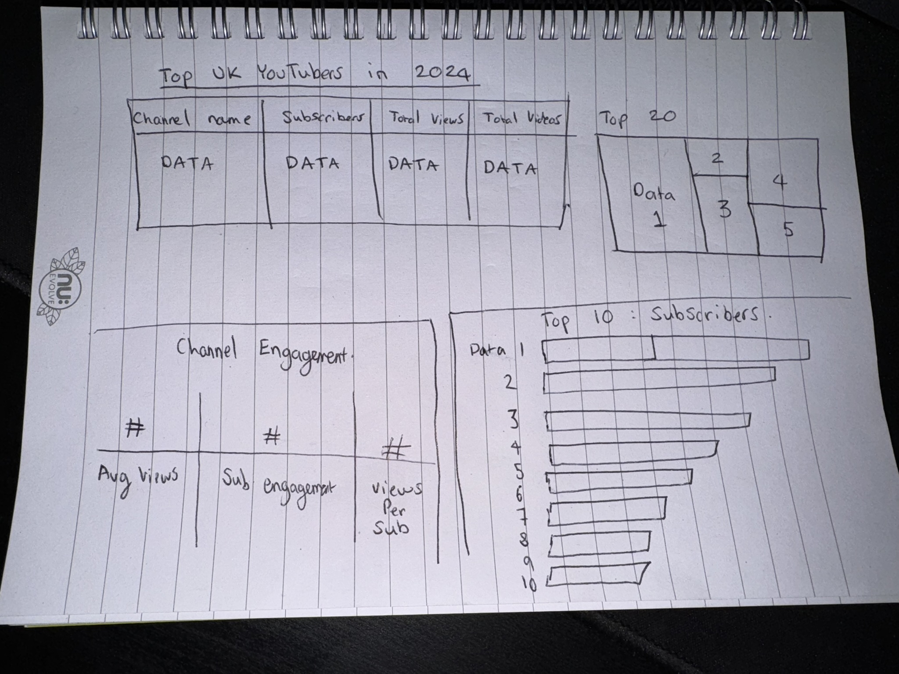

# Data Analysis Project 1: Top YouTubers 2024 
# Main Objective
* What are the client's requests?

The head of marketing is looking for the top YouTubers in order to run marketing campaigns throughout the rest of the year. Highest return on investment is the most important factor.
* How can I help?
By creating an interactive dashboard that showcases the top UK YouTubers, categorized by the following;
* Subscriber Count
* Total Views
* Total Videos uploaded
* Engagement metrics
This approach will provide the marketing team with useful insights before deciding which YouTuber(s) to collaborate with.

# Data source

Our data must include the following;
* Channel Names
* Total subscribers
* Total views
* Total videos uploaded

The data used for this project was sourced from Kaggle, which can be found [here.](https://www.kaggle.com/datasets/bhavyadhingra00020/top-100-social-media-influencers-2024-countrywise?resource=download).

# Project Stages

1. Design
2. Development
3. Testing
4. Analysis

# Design

## Dashboard Requirements
To understand what components are needed in the dashboard, we must come up with a set of questions that need to be answered:
1. Who are the top 10 YouTubers with the most subscribers?
2. Which 3 channels have uploaded the most videos?
3. Which 3 channels have the most views?
4. Which 3 channels have the highest average views per video?
5. Which 3 channels have the highest views per subscriber ratio?
6. Which 3 channels have the highest subcriber engagement rate per video?
If our dashboard is able to answer these questions, then it is safe to assume that the dashboard has effectively carried out it's purpose.

## Dashboard mockup
* What should the dashboard look like?
Visuals to be included are;
1. Table with all relevant data
2. Treemap of Top YouTubers
3. Scorecards for engagement statistics
4. Horizontal bar chart to allow for quick and easy comparison



## Tools used
| Tool | Purpose |
| --- | --- |
| Excel | To explore the data |
| SQL Server | To clean, test and analyze the data |
| Power BI | To create the interactive dashboard |
| GitHub | To host and document the project |

# Development

## The plan

* What is the approach I am taking, from start to finish?

1. Obtain the data from Kaggle
2. Explore the data in Excel
3. Load the data into SQL server
4. Clean the data with SQL
5. Analyze and perform quality checks of the data in SQL
6. Visualize the data in Power BI
7. Generate the findings based on the insights
8. Document the project
9. Publish the data to GitHub

## Data exploration 

During this stage, the data is scanned for errors, inconsistencies, weird characters, etc.
Some issues found were:

1. Channel ID and an '@' sign was found before the channel name in the same column - so we need to extract just the channel name from this.
2. Some cells were in a different language - had to confirm if these bits of data was needed.
3. Had more data than needed, so some were to be removed.

## Data cleaning

What do we mean by 'clean data'?
* Only relevant columns needed
* All data types should be appropriate
* No columns should contain missing values (or null values)#

Our cleaned data resulted in a total of 4 columns, each with 100 rows.

| Column Name | Data Type | Nullable |
| --- | --- | --- | 
| channel_name | VARCHAR | NO |
| total_subscribers | INTEGER | NO |
| total_views | INTEGER | NO | 
| total_videos | INTEGER | NO |

## Transforming the data in SQL Server

```sql
/*

# Data cleaning steps:

1. Remove unnecessary columns by only selecting the ones we need.
2. Extract the Youtube channel names from the first columns.
3. Rename the column names.

*/

CREATE VIEW view_uk_youtubers_2024 AS

SELECT
	CAST(SUBSTRING(NOMBRE, 1, CHARINDEX('@', NOMBRE)-1) AS VARCHAR(100)) as channel_name,
	total_subscribers,
	total_views,
	total_videos
	

FROM top_uk_youtubers_2024

```

# Testing

Here are the data quality checks conducted: 

## 1. Row count check 

```sql

-- 1. Row count check:

SELECT
  COUNT(*) AS no_of_rows
FROM
  view_uk_youtubers_2024;

```
## Column Count check

### SQL Query

```sql

-- 2. Column count check:
SELECT COUNT(*) as column_count 
FROM INFORMATION_SCHEMA.COLUMNS
WHERE TABLE_NAME = 'view_uk_youtubers_2024'

```

## Data Type check

### SQL Query

```sql

-- 3. Data type check

SELECT 
	COLUMN_NAME,
	DATA_TYPE
	
FROM 
	INFORMATION_SCHEMA.COLUMNS
WHERE
	TABLE_NAME = 'view_uk_youtubers_2024'
```

## Duplicate count check

### SQL Query

```sql

-- 4. Duplicate record check

SELECT channel_name,
		COUNT(*) as duplicate_count

from view_uk_youtubers_2024
GROUP BY channel_name
HAVING COUNT(*) > 1

```

# Visualization

## Results

* What does the dashboard look like?

insert dashboard image here!!

## DAX Measures

### 1. Total Subscribers (M)

```
Total Subscribers (M) = 
VAR million = 1000000
VAR sumOfSubscribers = SUM(view_uk_youtubers_2024[total_subscribers])
VAR totalSubscribers = DIVIDE(sumOfSubscribers, million)

RETURN totalSubscribers
```

### 2. Total Views (B)

```
Total Views (B) = 
VAR billion = 1000000000
VAR sumOfTotalViews = SUM(view_uk_youtubers_2024[total_views])
VAR totalViews = DIVIDE(sumOfTotalViews, billion)

RETURN totalViews
```

### 3. Total Videos

```
Total Videos = 
VAR totalVideos = SUM(view_uk_youtubers_2024[total_videos])

RETURN totalVideos
```

### 4. Average Views Per Video (M)

```
Avg views per video (M) = 
VAR sumOfTotalViews = SUM(view_uk_youtubers_2024[total_views])
VAR sumOfTotalVideos = SUM(view_uk_youtubers_2024[total_videos])
VAR avgViewsPerVideo = DIVIDE(sumOfTotalViews, sumOfTotalVideos, BLANK())
VAR finalAvgViewsPerVideo = DIVIDE(avgViewsPerVideo, 1000000, BLANK())

RETURN finalAvgViewsPerVideo
```

### 5. Subscriber Engagement Rate

```
Subscriber Engagement Rate = 
VAR sumOfTotalSubscribers = SUM(view_uk_youtubers_2024[total_subscribers])
VAR sumOfTotalVideos = SUM(view_uk_youtubers_2024[total_videos])
VAR subscriberEngRate = DIVIDE(sumOfTotalSubscribers, sumOfTotalVideos, BLANK())

RETURN subscriberEngRate
```

### 6. Views Per Subscriber

```
Views Per Subscriber = 
VAR sumOfTotalViews = SUM(view_uk_youtubers_2024[total_views])
VAR sumOfTotalSubscribers = SUM(view_uk_youtubers_2024[total_subscribers])
VAR viewsPerSubscriber = DIVIDE(sumOfTotalViews, sumOfTotalSubscribers, BLANK())

RETURN viewsPerSubscriber
```

# Analysis

## Findings

Our data has given us many insights regarding the Top UK YouTubers. It gives us the information needed to answer the following questions for our client:

1. Who are the top 10 YouTubers with the most subscribers?
2. Which 3 channels have uploaded the most videos?
3. Which 3 channels have the most views?
4. Which 3 channels have the highest average views per video?
5. Which 3 channels have the highest views per subscriber ratio?
6. Which 3 channels have the highest subscriber engagement rate per video uploaded?

### 1. Who are the Top 10 YouTubers with the most subscribers?

| Rank | Channel Name | Subscribers (M) |
| --- | --- | --- |
| 1 | NoCopyrightSounds | 33.60 |
| 2 | DanTDM | 28.60 |
| 3 | Dan Rhodes | 26.50 |
| 4 | Miss Katy | 24.50 |
| 5 | Mister Max | 24.40 |
| 6 | KSI | 24.10 |
| 7 | Jelly | 23.50 |
| 8 | Dua Lipa | 23.30 |
| 9 | Sidemen | 21.00 |
| 10 | Ali-A | 18.90 |

### 2. Which 3 channels have uploaded the most videos?

| Rank | Channel Name | Videos Uploaded |
| --- | --- | --- |
| 1 | GRM Daily | 14,696 |
| 2 | Manchester City | 8,248 |
| 3 | Yogscast | 6,435 |

### 3. Which 3 channels have the most views?

| Rank | Channel Name | Total Views (B) |
| --- | --- | --- |
| 1 | DanTDM | 19.78 |
| 2 | Dan Rhodes | 18.56 |
| 3 | Mister Max | 15.97 |

### 4. Which 3 channels have the highest average views per video? 

| Rank | Channel Name | Average Views per video (M) |
| --- | --- | --- |
| 1 | Mark Ronson | 32.27 |
| 2 | Jessie J | 5.97 |
| 3 | Dua Lipa | 5.76 |

### 5. Which 4 channels have the highest views per subscriber ratio?

| Rank | Channel Name | Views per Subscriber |
| --- | --- | --- |
| 1 | GRM Daily | 1185.79 |
| 2 | Nickelodeon | 1061.04 |
| 3 | Disney Junior UK | 1031.97 |

### 6. Which 3 channels have the highest subscriber engagement rate per video uploaded?

| Rank | Channel Name | Subscriber Engagement Rate |
| --- | --- | --- |
| 1 | Mark Ronson | 343,000 |
| 2 | Jessie J | 110,416.67 |
| 3 | Dua Lipa | 104,954.95 |

### Notes

For this analysis, we'll prioritize analysing the metrics that are important in finding out what the highest ROI is for our client, which are the channels that have the most subscribers, total views, videos uploaded.

## Validation 

### 1. YouTubers with the most subscribers

**Calculation breakdown**
Campaign idea = product placement

-- NonCopyrightSounds
Average views per video = 6.92 million
Product cost = $5
Potential units sold per video = 6.92 million x 2% conversion rate = 138,400 units sold
Potential revenue per video = 138,400 x $5 = $692,000
Campaign cost (one-time fee) = $50,000
**Net profit = $692,000 - $50,000 = $642,000**


-- DanTDM
Average views per video = 5.34 million
Product cost = $5
Potential units sold per video = 5.34 million x %2 conversion rate = 106,800 units sold
Potential revenue per video = 106,800 x $5 = $534,000
Campaign cost (one-time fee) = $50,000
**Net profit = $534,000 - $50,000 = $484,000**


-- Dan Rhodes
Average views per video = 11.15 million
Product cost = $5
Potential units sold per video = 11.15 million x 2% conversion rate = 223,000 units sold
Potential revenue per video = 223,000 x $5 = $1,115,000
Campaign cost = $50,000
**Net profit = $1,115,000 - $50,000 = $1,065,000**


**The most profitable YouTuber would be Dan Rhodes.**

**SQL Query**

```sql

/*

1. Define the variables
2. Create a CTE that rounds the average views per video
3. Select the columns that are required for the analysis
4. Filter the results by the YouTube channels with the highest subscriber bases
5. Order by net_profit (from highest to lowest)


*/

--1.
DECLARE @conversionRate FLOAT = 0.02; -- The conversation rate, which is 2%
DECLARE @productCost MONEY = 5.0; -- The product cost, which is $5 USD
DECLARE @campaignCost MONEY = 50000.0; -- The campaign cost, which is $50,000 USD


--2.
WITH ChannelData as (
	SELECT 
		channel_name,
		total_views,
		total_videos,
		ROUND((CAST(total_views as FLOAT) / total_videos), -4) AS rounded_avg_views_per_video
	FROM 
		youtube_db.dbo.view_uk_youtubers_2024

)
-- 3.
SELECT 
	channel_name,
	rounded_avg_views_per_video,
	(rounded_avg_views_per_video * @conversionRate) AS potential_units_sold_per_video,
	(rounded_avg_views_per_video * @conversionRate * @productCost) AS potential_revenue_per_video,
	(rounded_avg_views_per_video * @conversionRate * @productCost) - @campaignCost AS net_profit
FROM 
	ChannelData	
-- 4.
WHERE 
	channel_name IN ('NoCopyrightSounds', 'DanTDM', 'Dan Rhodes')


--5. 
ORDER BY
	net_profit DESC

```


### 2. YouTubers with the most videos uploaded

**Calculation breakdown**
Campaign idea = sponsored video series
1. GRM Daily

Average views per video = 510,000
Product cost = $5
Potential units sold per video = 510,000 x 2% conversion rate = 10,200 units sold
Potential revenue per video = 10,200 x $5 = $51,000
Campaign cost (11 videos at $5,000 each) = $55,000
**Net profit = $51,000 - $55,000 = -$4,000 (potential loss)**

2. Manchester City
Average views per video = 240,000
Product cost = $5
Potential units sold per video = 240,000 x 2% conversion rate = 4,800 units sold
Potential revenue per video = 4,800 x $5 = $24,000
Campaign cost (11-videos at $5,000 each) = $55,000
**Net profit = $24,000 - $55,000 = -$31,000 (potential loss)**

3. Yogscast
Average views per video = 710,000
Product cost = $5
Potential units sold per video = 710,000 x 2% conversion rate = 14,200 units sold
Potential revenue per video = 14,200 x $5 = $71,000
Campaign cost (11-videos at $5,000 each) = $55,000
**Net profit = $71,000 - $55,000 = $16,000 (potential profit)**

**Most profitable client is Yogscast**

**SQL Query**

```sql

DECLARE @conversionRate FLOAT = 0.02; -- The conversation rate, which is 2%
DECLARE @productCost MONEY = 5.0; -- The product cost, which is $5 USD
DECLARE @campaignCost MONEY = 50000.0; -- The campaign cost, which is $50,000 USD


--2.
WITH ChannelData as (
	SELECT 
		channel_name,
		total_views,
		total_videos,
		ROUND((CAST(total_views as FLOAT) / total_videos), -4) AS rounded_avg_views_per_video
	FROM 
		youtube_db.dbo.view_uk_youtubers_2024

)
-- 3.
SELECT 
	channel_name,
	rounded_avg_views_per_video,
	(rounded_avg_views_per_video * @conversionRate) AS potential_units_sold_per_video,
	(rounded_avg_views_per_video * @conversionRate * @productCost) AS potential_revenue_per_video,
	(rounded_avg_views_per_video * @conversionRate * @productCost) - @campaignCost AS net_profit
FROM 
	ChannelData	
-- 4.
WHERE 
	channel_name IN ('GRM Daily', 'Man City', 'YOGSCAST Lewis & Simon')


--5. 
ORDER BY
	net_profit DESC

```

## 3. YouTubers with the most views

**Calculation breakdown**
Campaign idea = Influencer marketing
1. DanTDM
Average views per video = 5.34 miliion
Product cost = $5
Potential units sold per video = 5.34 million x 2% conversion rate = 106,800 units sold
Potential revenue per video = 106,800 x $5 = $534,000
Campaign cost (3 month contract) = $130,000
**Net profit = $534,000 - $130,000 = $404,000**

2. Dan Rhodes
Average views per video = 11.15 million
Product cost = $5
Potential units sold per video = 11.15 million x 2% conversion rate = 223,000 units sold
Potential revenue per video = 223,000 x $5 = $1,115,000
Campaign cost (3 month contract) = $130,000
**Net profit = $1,115,000 - $130,000 = $985,000**

3. Mister Max
Average views per video = 14.06 million
Product cost = $5
Potential units sold per video = 14.06 million x 2% conversion rate = 281,200 units sold
Potential revenue per video = 281,200 x $5 = $1,406,000
Campaign cost (3 month contract) = $130,000
**Net profit = $1,406,000 - $130,000 = $1,276,000**

**Most profitable YouTuber would be Mister Max**

**SQL Query**

```sql

--1.
DECLARE @conversionRate FLOAT = 0.02; -- The conversation rate, which is 2%
DECLARE @productCost MONEY = 5.0; -- The product cost, which is $5 USD
DECLARE @campaignCost MONEY = 50000.0; -- The campaign cost, which is $50,000 USD


--2.
WITH ChannelData as (
	SELECT 
		channel_name,
		total_views,
		total_videos,
		ROUND((CAST(total_views as FLOAT) / total_videos), -4) AS rounded_avg_views_per_video
	FROM 
		youtube_db.dbo.view_uk_youtubers_2024

)
-- 3.
SELECT 
	channel_name,
	rounded_avg_views_per_video,
	(rounded_avg_views_per_video * @conversionRate) AS potential_units_sold_per_video,
	(rounded_avg_views_per_video * @conversionRate * @productCost) AS potential_revenue_per_video,
	(rounded_avg_views_per_video * @conversionRate * @productCost) - @campaignCost AS net_profit
FROM 
	ChannelData	
-- 4.
WHERE 
	channel_name IN ('Mister Max', 'DanTDM', 'Dan Rhodes')


--5. 
ORDER BY
	net_profit DESC


```

# Final Report

## What are the findings?

1. NoCopyrightSounds, Dan Rhodes and DanTDM are the channels with the most subscribers in the UK
2. GRM Daily, Man City and Yogscast are the channels with the most videos uploaded
3. DanTDM, Dan Rhodes and Mister Max are the channels with the most views
4. Entertainment channels are better for a broader reach - these channels have the highest engagement statisitcs.

## Recommendations

1. Dan Rhodes is the best YouTuber to collaborate with to maximise visibility because this channel has the most subscribers in the UK
2. GRM Daily, Man City and Yogscast should probably not be collaborated with in this project, considering the potential loss of money would not be worth the effort.
3. Mister Max is the best YouTuber to collaborate with if we are interested in maximising reach due to him having the highest amount of views.
4. The top 3 channels to collaborate with are NonCopyrightSounds, DanTDM and Dan Rhodes because they have the highest engagement, thus resulting in the highest potential ROI.

## Potential ROI

1. Collaboration deal with Dan Rhodes could result in a net profit of $1,065,000 per video.
2. An influencer marketing contract with Mister Max could result in a net profit of $1,276,000.
3. A Product placement campaign with DanTDM could generate $484,000 per video, or a one-off profit of $404,000 with a marketing campaign instead.
4. NonCopyrightSounds could result in a net profit of $642,000 per video.
   
## Recommended Action Plan

With regards to our analysis, we believe that the best channel to advance a long-term partnership deal with to promote the client's products is the Dan Rhodes channel.
Once the expected milestones have been reached with the Dan Rhodes channel, we can consider advancing to partnerships with DanTDM, Mister Max and NoCopyrightSounds channels in the future.

### What are the next steps?

1. Reach out to the teams of each of the channels, starting with Dan Rhodes.
2. Negotiate contracts within our allocated budgets.
3. Start the campaigns and track the performances against the KPIs (key performance indicators) such as product sales, website traffic, etc.
4. Review each of the campaigns, gather insights and look to improve based on feedback from channel audiences and customers.


# Acknowledgements

While a lot of hard work has gone in to this project, I would like to give credit to Stephen David-Williams for walking me through this project, and providing help throughout. Related links can be found below:

**Stephen's LinkedIn : https://www.linkedin.com/in/stephen-david-williams-860428123/**

**Stephen's YouTube : https://www.youtube.com/@sdw-online**


